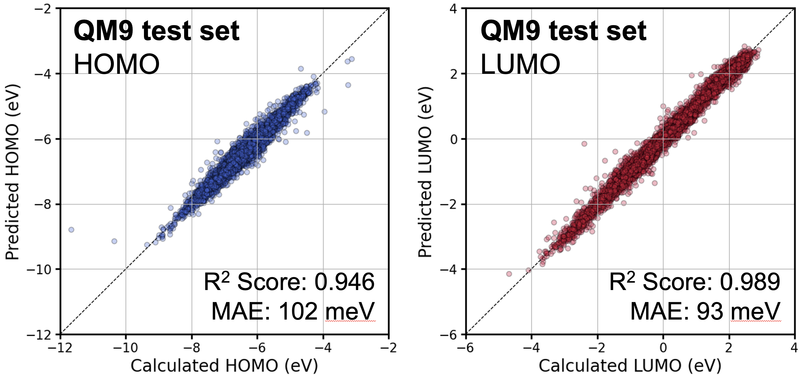

%20%7C%20macOS%20%7C%20Windows-lightgrey?style=plastic&logo=linux&logoColor=white)
[](https://www.python.org/downloads/)
[](https://developer.nvidia.com/cuda-toolkit)

[](https://numpy.org/)
[](https://pandas.pydata.org/)
[](https://github.com/tqdm/tqdm)
[](https://pytorch.org/)
[](https://huggingface.co/docs/transformers/index)

# DyGPT
DyGPT is an enhanced version of the [BaseGPT](https://github.com/wkdghdus23/BaseGPT.git) framework, designed to further improve the learning and prediction of molecular properties through several key enhancements. The primary differences compared to BaseGPT are as follows:

- **Learning Rate Scheduler**: Unlike BaseGPT, DyGPT introduces a learning rate scheduler to better control the training process. This scheduler helps adjust the learning rate dynamically during training.
- **Hybrid Loss Function**: By combining MAE (Mean Absolute Error) and MSE (Mean Squared Error) into a hybrid loss function, DyGPT leverages the strengths of both metrics. MSE is more sensitive to outliers, making it useful for emphasizing larger errors, while MAE is less sensitive to outliers, helping to stabilize the model's learning.

### Platform Support
DyGPT is primarily designed for Linux environments and supports all major platforms including Windows and macOS. While Linux is the recommended environment for optimal performance and ease of using command-line tools, the package is compatible with:
   - **Linux**: Recommended for command-line tools and model training with GPU.
   - **macOS**: Fully supported, but some command-line tools may need adaptation.
   - **Windows**: Python API works well, but Linux-based commands may require adjustment.

### Prerequisites
   - **Python**: Python 3.8 or later (recommended: 3.8+)
   - **CUDA**: CUDA 12.2 or later
   - **PyTorch**: PyTorch 2.4.1 or later. If you plan to use GPU acceleration, make sure the CUDA version is compatible with your PyTorch version. For more details, refer to the [PyTorch website](https://pytorch.org/)
   - **Transformers**: Transformers 4.44.2 or later
   - **NumPy**: NumPy 1.24.3 or later
   - **Pandas**: Pandas 2.0.3 or later
   - **tqdm**: tqdm 4.66.5 or later
   - **Miniconda/Conda**: It is recommended to use Miniconda or Conda to create an isolated environment for this package.

# Table of Contents
- [Installation](#installation)
- [Usage](#usage)
- [Features](#features)
- [License](#license)

# Installation
### 1. Install Miniconda:
If you do not have **Miniconda** installed, you can download it from [Miniconda Downloads](https://docs.conda.io/en/latest/miniconda.html) and follow the installation instructions for your operating system.


### 2. (Optional) Create a virtual environment:
It is recommended to create a virtual environment to manage dependencies.
   ```bash
   # Create a virtual environment
   conda create -n dygpt python=3.8 -y

   # Activate the virtual environment**
   conda activate dygpt
   ```

### 3. Clone this repository:
If you don't have Git installed, please install it from Git Downloads.
   ```bash
   git clone https://github.com/wkdghdus23/DyGPT.git
   ```

### 4. Move to the basegpt folder:
   ```bash
   cd (path/to/your/package)/DyGPT/dygpt/
   ```

### 5. Install the package:
   ```bash
   pip install -e .
   ```
**Ensure that your device's GPU CUDA version is compatible with the PyTorch CUDA version.** See the [PyTorch website](https://pytorch.org/) for more information.
To check CUDA version compatibility, you can use the following commands:
   ```bash
   # Check CUDA version installed on your system
   nvidia-smi

   # Check the CUDA version supported by PyTorch
   python -c "import torch; print(torch.version.cuda)"
   ```

### 6. Add the Python path to your environment:
**Option 1**: Set `PYTHONPATH` temporarily (recommended for virtual environments)
If you are using a virtual environment (e.g., with Miniconda), you can set the `PYTHONPATH` temporarily within the active session.

   - **Step 1**. Create an activation script that sets the `PYTHONPATH` every time the environment is activated:
   ```bash
   mkdir -p $CONDA_PREFIX/etc/conda/activate.d
   echo "unset PYTHONPATH" >> $CONDA_PREFIX/etc/conda/activate.d/env_vars.sh
   echo "export PYTHONPATH=$PYTHONPATH:(path/to/your/package)/DyGPT/" >> $CONDA_PREFIX/etc/conda/activate.d/env_vars.sh
   ```
   - **Step 2**. Create a deactivation script to unset `PYTHONPATH` when the environment is deactivated:
   ```bash
   mkdir -p $CONDA_PREFIX/etc/conda/deactivate.d
   echo "unset PYTHONPATH" >> $CONDA_PREFIX/etc/conda/deactivate.d/env_vars.sh
   ```
   This will make sure that the `PYTHONPATH` variable is cleared when the environment is deactivated, preventing any unwanted effect on other environments or system-level Python sessions.
   - **Step 3**. Restart your virtual environment
   After adding the activation and deactivation scripts, you need to **deactivate and reactivate** your virtual environment for the changes to take effect.
   You can do this by running:
   ```
   conda deactivate
   conda activate dygpt
   ```
   This step is necessary because the environment variables set by the activation script are only applied when the environment is first activated. If you make changes to these scripts, you need to deactivate and reactivate the environment to see those changes reflected.

**Option 2**: Set `PYTHONPATH` permanently (not recommended for virtual environments)
If you are not using a virtual environment and want to make `PYTHONPATH` changes permanent across terminal sessions, add the following line to your `.bashrc` or `.zshrc` file:
   ```bash
   echo 'export PYTHONPATH=$PYTHONPATH:(path/to/your/package)/DyGPT/' >> ~/.bashrc
   source ~/.bashrc
   ```
This will ensure that `PYTHONPATH` is set globally every time a new terminal session is started.

**Note**: If you move the location of the DyGPT package, you will need to update the `PYTHONPATH` in your `.bashrc` (or the corresponding activation script for virtual environments) to point to the new path. Not doing this may lead to errors when trying to use the package.

### 7. Verify the installation:
   ```bash
   python -c "import dygpt; print('DyGPT package installed successfully.')"
   ```

# Usage
### Command Line Arguments
   - `--task`: The task type to perform. Options are:
      - `causallm`: Causal Language Modeling to predict the next tokens in a sequence.
      - `downstream`: Train a downstream model to predict chemical properties.
      - `conditional`: Generate SMILES sequences based on specific conditions.
   - `--pretrained`: Path to a pre-trained model. Used as the starting point for fine-tuning, `downstream` or `conditional` tasks.
   - `--dataset`: Path to the dataset file in `.csv` format.
   - `--vocabfile`: Path to the vocabulary file used for tokenizing the string data (default: `./vocab.txt`).
   - `--max_len`: The maximum sequence length for tokenization.
   - `--batchsize`: Batch size for training.
   - `--epochs`: Number of epochs for training.
   - `--modelsavepath`: Path where the trained or fine-tuned model will be saved.
   - `--target`: List of target properties for downstream tasks. **Only used for the `downstream` task**. Specifies which chemical properties to predict during the downstream task (e.g., `--target HOMO LUMO`).

### Examples
Before running the examples, move to the example directory, which contains the QM9 dataset.
   ```bash
   cd (path/to/your/package)/DyGPT/example
   ```

### Task 1. Train the Causal Language Model (CausalLM) using the QM9 dataset
In this example, you will train a Causal Language Model (`causallm`) using the QM9 dataset. This helps the model learn contextual embeddings for chemical structures, which can be useful for `downstream` or `conditional` tasks.

Perform the training task with the following parameters:

   - **Maxumum length**: 256 of maxumum sequence length for tokenization.
   - **Batch size**: 32 (The number of samples processed before the model is updated).
   - **Epochs**: 10 (The number of complete passes through the entire dataset).
   - **Dataset**: QM9 dataset in CSV format.
   ```bash
   dygpt --task causallm --max_len 256 --batchsize 32 --epochs 10 --dataset ./QM9.csv
   ```

### Task 2. Load pre-trained MLM and train the downstream model (HOMO and LUMO values in QM9 dataset)
After training the `causallm` task, you can use it for `downstream` tasks. In this example, you will load the pre-trained `causallm` and train a `downstream` model to predict the HOMO and LUMO values in the QM9 dataset.

Perform the downstream training task with the following parameters:

   - **Target**: HOMO and LUMO values.
   - **Maxumum length**: 256 of maxumum sequence length for tokenization.
   - **Batch size**: 32 (The number of samples processed before the model is updated).
   - **Epochs**: 20 (The number of complete passes through the entire dataset).
   - **Dataset**: QM9 dataset in CSV format.
   - **Pre-trained Model**: The path to the pre-trained `causallm` model.
   ```bash
   dygpt --task downstream --target HOMO LUMO --max_len 256 --batchsize 32 --epochs 20 --dataset ./QM9.csv --pretrained (path/to/pre-trained/model)
   ```

### Model Performance
The performance of the DyGPT was evaluated on the prediction of HOMO and LUMO values. The scatter plots below illustrate the correlation between the calculated and predicted values for the HOMO and LUMO.
   - **HOMO Prediction (Left):**
      - R² score: 0.945
      - MAE: 102 meV
   - **LUMO Prediction (Right):**
      - R² score: 0.989
      - MAE: 93 meV



### Task 3. Load Trained Model and Predict Chemical Properties
This section demonstrates how to **load pre-trained model** and use it to **predict HOMO and LUMO** properties of given SMILES.
   ```python
   import os
   import torch
   from transformers import BertTokenizer
   from dygpt.tokenizer import Tokenizer, initial_tokenizer_with_vocabulary
   from dygpt import GPTForDownstream
   
   # Create the vocabulary and initialize tokenizer
   vocab_file_path = './vocab.txt'
   tokenizer = initial_tokenizer_with_vocabulary(path=vocab_file_path, target_name=['HOMO', 'LUMO'])
   
   # Load the pre-trained model and tokenizer
   pretrained_model_path = '(path/to/pretrained/model)'
   
   # Load the pre-trained downstream model
   model = GPTForDownstream.from_pretrained_model(pretrained_path=pretrained_model_path, tokenizer=tokenizer, target_name=['HOMO', 'LUMO'])
   state_dict = [torch.load(os.path.join(pretrained_model_path, f), weights_only=True) for f in os.listdir(pretrained_model_path) if f.endswith('.pt')][0]
   model.load_state_dict(state_dict)
   
   # Prepare the input data (example SMILES strings)
   input_data = ['O=C=O',
                 'C(=O)N',
                 "O=[S][N]S[N][S]=O",
                 'CN1CCN(C)[C@@H](C(Cl)(Cl)Cl)[C@H]1[C]([NH])O']  # Example SMILES strings representing different molecules
   
   # Tokenize the input SMILES strings and prepare inputs for the model
   inputs = Tokenizer(smiles=input_data, vocab_file=vocab_file_path, tokenizer=tokenizer, max_len=256)
   
   # Convert tokenized inputs to PyTorch tensors
   input_ids = torch.tensor(inputs['input_ids'], dtype=torch.long)
   attention_mask = torch.tensor(inputs['attention_mask'], dtype=torch.long)
   
   # Perform prediction
   model.eval()  # Set model to evaluation mode
   with torch.no_grad():  # Disable gradient calculations for inference
       # Make predictions and convert to NumPy array
       outputs = model(input_ids=input_ids, attention_mask=attention_mask).numpy()
   
   # Print predicted properties for each input
   print("Predicted properties:", outputs)
   ```

### Task 4. Generate SMILES sequences based on specific conditions (Conditional Generation)
The conditional task allows you to generate SMILES sequences conditioned on specific molecular properties, such as HOMO and LUMO values. This task leverages a pre-trained `causallm` model to generate molecules that meet the given property requirements.

Perform the `conditional` task with the following parameters:

   - **Target**: HOMO and LUMO values to condition the SMILES generation.
   - **Maxumum length**: 256 of maxumum sequence length for tokenization.
   - **Batch size**: 32 (The number of samples processed before the model is updated).
   - **Epochs**: 10 (The number of complete passes through the entire dataset for fine-tuning the generation model).
   - **Dataset**: Canonical JCESR dataset in CSV format.
   - **Pre-trained Model**: The path to the pre-trained model.
   ```bash
   dygpt --task conditional --target HOMO LUMO --max_len 256 --batchsize 32 --epochs 10 --dataset ./QM9.csv --pretrained (path/to/pre-trained/model)

   ```

This section demonstrates how to load a pre-trained `conditional` model and use it to generate SMILES sequences based on specific **HOMO** or **LUMO** properties, or other conditions. By specifying property values such as HOMO or LUMO, as well as optional atomic conditions (e.g., the presence of Fluorine), the model generates SMILES strings that satisfy these conditions.
   ```python
   import torch
   from dygpt import GPTForCausalLM
   from dygpt.tokenizer import initial_tokenizer_with_vocabulary
   from tqdm.auto import tqdm
   
   # Vocabulary file and model configuration
   vocab_file = './vocab.txt'
   target_name = ['HOMO', 'LUMO']
   model_path = '/home/wkdghdus23/Package/BaseGPT/test/results/conditional_batchsize32_epochs10/' 
   
   # Maximum sequence length for SMILES generation
   max_length = 50 
   
   # Initialize tokenizer with the given vocabulary and target properties
   tokenizer = initial_tokenizer_with_vocabulary(path=vocab_file, target_name=target_name)
   
   # Load the trained conditional generation model checkpoint
   checkpoint = torch.load(f"{model_path}/ConditionalModel.pt", weights_only=False, map_location=torch.device('cpu'))
   
   # Initialize the GPT model for causal language modeling
   model = GPTForCausalLM(tokenizer=tokenizer, target_name=target_name)
   model.load_state_dict(checkpoint)
   model.eval()
   
   # Input preparation for conditional generation
   input_ids = []
   homovalue = None # HOMO value for conditional generation (set a specific value or None)
   lumovalue = -4.0 # LUMO value for conditional generation (set a specific value or None)
   element_condition = ['F'] # Elemental condition for generation (e.g., specific atoms like Fluorine)
   
   # Add conditions to input_ids
   input_ids, conditions = [], []
   if homovalue:
       input_ids.append(tokenizer.convert_tokens_to_ids("[HOMO]"))
       conditions.append(homovalue)
   if lumovalue:
       input_ids.append(tokenizer.convert_tokens_to_ids("[LUMO]"))
       conditions.append(lumovalue)
   
   # Add the separator token to indicate the start of the embedding
   input_ids.append(tokenizer.convert_tokens_to_ids("[SEP]"))
   
   # Add elemental conditions to the input sequence
   if element_condition:
       for ele in element_condition:
           input_ids += tokenizer(ele)['input_ids']
   
   # Convert input sequence to a tensor
   input_ids = torch.tensor([input_ids], dtype=torch.long)
   attention_mask = torch.ones_like(input_ids)
   conditions = torch.tensor([conditions])
   labels = None
   
   # Start generation loop
   generated = input_ids
   for _ in tqdm(range(max_length)):
       with torch.no_grad():
           outputs = model(input_ids=generated, attention_mask=attention_mask, labels=labels, conditions=conditions)
           logits = outputs.logits[:, -1, :]
   
           # Select the next token (using greedy sampling here)
           next_token_id = torch.argmax(logits, dim=-1).item()
   
           # Append the next token to the generated sequence
           generated = torch.cat([generated, torch.tensor([[next_token_id]])], dim=1)
   
           # Stop generation if the [EOS] token is encountered
           if next_token_id == tokenizer.convert_tokens_to_ids("[EOS]"):
               break
   
   # Decode the generated tokens into a SMILES string
   generated_smiles = tokenizer.decode(generated[0].tolist(), skip_special_tokens=True)
   
   # Output the generated SMILES string
   print(generated_smiles)
   ```

**Note**: This generation script is designed as a simple example to demonstrate the basic process of conditional SMILES generation. For practical applications, additional steps should be incorporated, such as probabilistic generation techniques (e.g., top-K or nucleus sampling) and chemical structure validation using tools like RDKit. Please consider this as an introductory example for understanding the conditional generation process with the model.

# Features
- **Causal Language Modeling (causallm)**: Generate sequences by predicting the next token in a string using a GPT-2-based architecture, enabling robust modeling of unidirectional dependencies in molecular representations.
- **Downstream Property Prediction**: Predict chemical properties using a pre-trained model.
- **Conditional Molecular Generation**: Generate SMILES sequences conditioned on specific properties, such as HOMO, LUMO, or atomic compositions.
- **Custom Tokenizer for SMILES**: A tokenizer specifically optimized for chemical structure representations in SMILES format.
- **Easy Integration**: Command-line interface (CLI) and Python API for seamless integration into your workflows.
- **GPU Acceleration**: Utilize CUDA-enabled GPUs to significantly speed up training and prediction.

**Note**: This project is designed as an introductory tutorial, allowing users to easily explore and experience GPT2-based modeling for molecular property prediction. It aims to provide a straightforward and hands-on approach for beginners interested in machine learning applications in chemistry.

Additionally, DyGPT builds upon [BaseGPT](https://github.com/wkdghdus23/BaseGPT.git), serving as an example of how users can enhance the performance of their models. This tutorial demonstrates step-by-step methods for improving BaseGPT, offering insights and practical guidance for optimizing GPT2-based molecular property prediction models.

**At this time, contributions and GitHub issues are not required or actively monitored, as the primary focus is on providing a self-contained tutorial resource.** I appreciate your understanding and hope this project helps you get started with GPT2-based modeling.

# License
This project is licensed under the MIT License. See the [LICENSE](LICENSE) file for more details.
